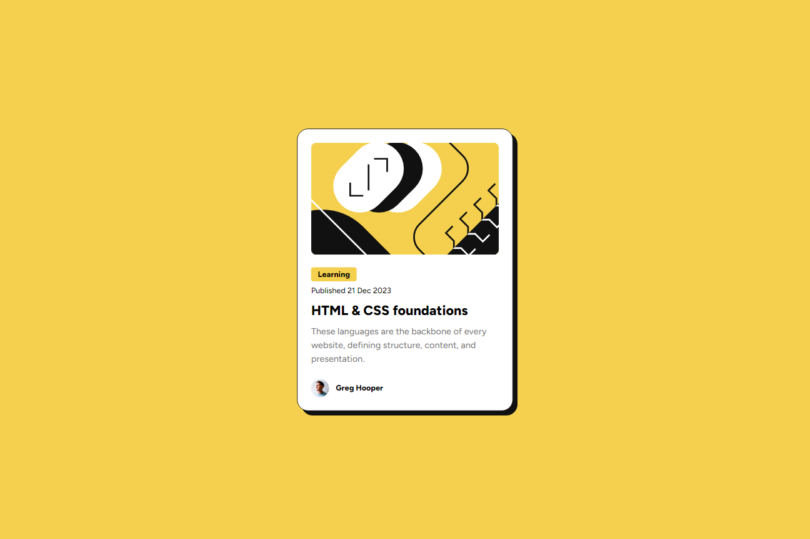
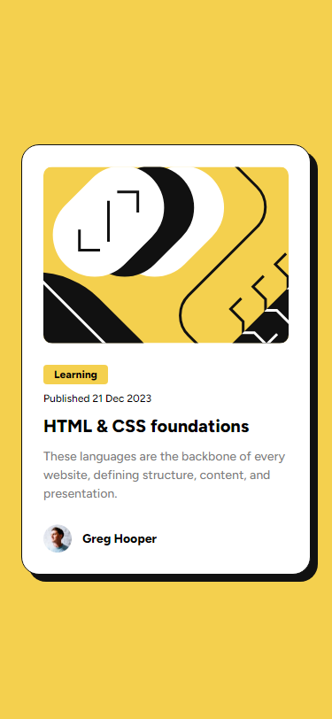

# Frontend Mentor - Blog preview card solution

This is a solution to the [Blog preview card challenge on Frontend Mentor](https://www.frontendmentor.io/challenges/blog-preview-card-ckPaj01IcS). Frontend Mentor challenges help you improve your coding skills by building realistic projects. 

## Table of contents

- [Overview](#overview)
  - [The challenge](#the-challenge)
  - [Screenshot](#screenshot)
  - [Links](#links)
- [My process](#my-process)
  - [Built with](#built-with)
  - [What I learned](#what-i-learned)
- [Author](#author)

## Overview

### The challenge

Users should be able to:

- See hover and focus states for all interactive elements on the page

### Screenshot

#### Desktop

#### Mobile

### Links

- Solution URL: [Add solution URL here](https://your-solution-url.com)
- Live Site URL: [LINK](https://kinqbert.github.io/blog-preview-card/)

## My process

### Built with

- Semantic HTML5 markup
- BEM
- CSS
- Flexboxes
- Desktop-first workflow

### What I learned

Learned how to use CSS Grid and Flexbox to create a responsive layout. I also learned how to use media queries to make the layout responsive on different screens.

## Author

- Frontend Mentor - [@kinqbert](https://www.frontendmentor.io/profile/kinqbert)
- LinkedIn - [Maksym Perekhodko](https://www.linkedin.com/in/maksym-perekhodko/)
- GitHub - [@kinqbert](https://github.com/kinqbert)
- Telegram - [@kinqbert](https://t.me/perekhodko_m)
